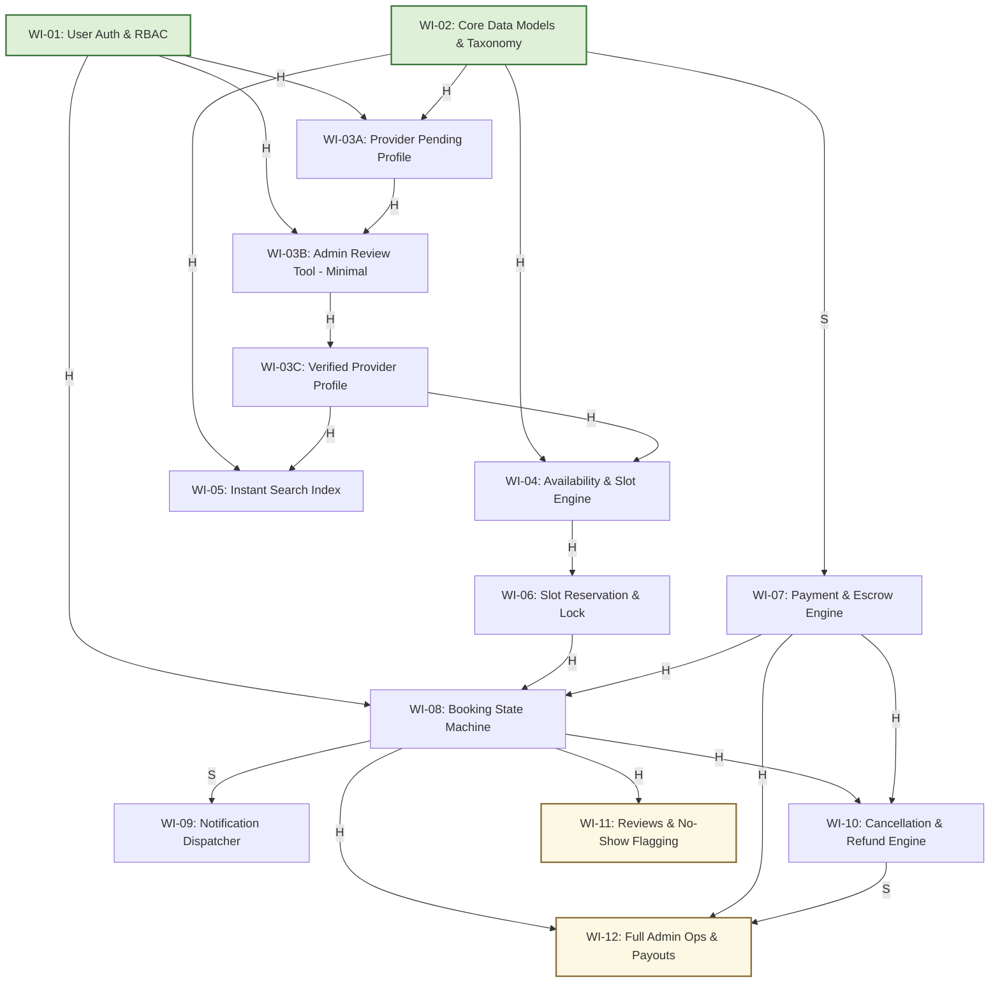

# Module 02: SkillSwap Directed Acyclic Graph (DAG) & Work Item Sequencing

## 1. Buildable Work Item Decomposition (13 Work Items with Cycle Split)

| Item ID | Work Item Name | Scope & Deliverables | Module 01 Reqs Covered |
| :--- | :--- | :--- | :--- |
| **WI-01** | **User Authentication & RBAC** | Signup, login, JWT token issuance, session middleware, role checks (Learner, Provider, Admin). | REQ-LRN-07, REQ-PRV-03, REQ-OPS-01 |
| **WI-02** | **Core Data Models & Category Taxonomy** | PostgreSQL schema for Users, Categories, City entities, and Provider Listing metadata. | REQ-LRN-01, REQ-PRV-02, REQ-OPS-04 |
| **WI-03A** | **Provider Onboarding & Pending Profile** | Provider draft submission, bio, hourly rates, service descriptions, credential upload (`PENDING` status). | REQ-PRV-02, REQ-PRV-05 |
| **WI-03B** | **Admin Review Tool (Minimal Approval API)** | Minimal admin endpoint/CLI to inspect pending provider credentials and transition state to `APPROVED`. | REQ-PRV-05, REQ-OPS-01 |
| **WI-03C** | **Verified Provider Profile & Public Listing** | Public profile view, verified badge, aggregate reviews display, and public discovery enablement. | REQ-LRN-02, REQ-PRV-02 |
| **WI-04** | **Availability & Slot Schedule Engine** | Provider weekly recurring availability rule engine, slot generator, and timezone offset normalizer. | REQ-PRV-01 |
| **WI-05** | **Instant Search & Category Index** | Category filtering, provider search query optimization (<200ms p95 index), and city scoping. | REQ-LRN-01, REQ-LRN-06, REQ-OPS-04 |
| **WI-06** | **Slot Reservation & Concurrency Lock** | 5-minute atomic checkout hold, race-condition mitigation (`SELECT FOR UPDATE`), and timeout expiry. | REQ-LRN-03, REQ-OPS-05, REQ-OPS-06 |
| **WI-07** | **Payment Processing & Escrow Capture** | Gateway integration (Stripe), charge authorization, escrow capture, and 15% platform commission ledger. | REQ-LRN-03, REQ-PRV-06 |
| **WI-08** | **Booking Orchestration & State Machine** | Booking lifecycle engine (`PENDING_PAYMENT` -> `CONFIRMED` -> `COMPLETED` -> `CANCELLED`). | REQ-LRN-03, REQ-PRV-03 |
| **WI-09** | **Notification & Email Dispatcher** | Async worker for booking confirmations, ICS calendar attachments, and cancellation alerts. | REQ-LRN-04 |
| **WI-10** | **Cancellation & Automated Refund Engine** | Cooling-off policy evaluation, automated gateway refunds, and slot release back to availability pool. | REQ-LRN-05, REQ-PRV-07 |
| **WI-11** | **Reviews, Ratings & No-Show Flagging** | Post-session 1-5 star review submission, aggregate rating compute, and provider no-show reporting. | REQ-LRN-08, REQ-PRV-04 |
| **WI-12** | **Admin Console, Disputes & Payouts (Full)** | Ops dispute console, manual refund overrides, 7-day rolling provider payout batch job, and telemetry. | REQ-OPS-02, REQ-OPS-03, REQ-OPS-07 |

---

## 2. Visual Dependency Graph (Acyclic Mermaid DAG)

---

## 3. Cycle Diagnosis & Node-Splitting Resolution

### Circular Dependency Discovered:
- `Provider Vetting` -> required `Admin Dashboard` -> required `Provider Data` -> required `Provider Vetting`.

### Design Resolution (Node Splitting):
- **Split Admin Dashboard:** Created `WI-03B (Admin Review Tool - Minimal)` to provide atomic approval status transitions without waiting for the full analytics/dispute suite.
- **Split Provider Profile Lifecycle:** Created `WI-03A (Draft/Pending Submission)` and `WI-03C (Approved Public Profile)`.
- **Acyclic Sequencing:** `WI-03A` -> `WI-03B` -> `WI-03C` cleanly unblocks Search (`WI-05`) and Availability (`WI-04`), while leaving the full Admin Ops Suite (`WI-12`) as non-blocking parallel work.
