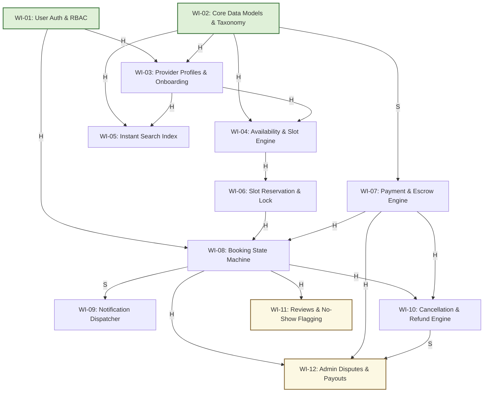

# Module 02: SkillSwap Directed Acyclic Graph (DAG) & Work Item Sequencing

## 1. Buildable Work Item Decomposition (12 Work Items)

| Item ID | Work Item Name | Scope & Deliverables | Module 01 Reqs Covered |
| :--- | :--- | :--- | :--- |
| **WI-01** | **User Authentication & RBAC** | Signup, login, JWT token issuance, session middleware, role checks (Learner, Provider, Admin). | REQ-LRN-07, REQ-PRV-03, REQ-OPS-01 |
| **WI-02** | **Core Data Models & Category Taxonomy** | PostgreSQL schema for Users, Categories, City entities, and Provider Listing metadata. | REQ-LRN-01, REQ-PRV-02, REQ-OPS-04 |
| **WI-03** | **Provider Profiles & Onboarding Vetting** | Provider public bio, hourly rates, service descriptions, credential upload, and admin vetting workflow. | REQ-LRN-02, REQ-PRV-02, REQ-PRV-05, REQ-OPS-01 |
| **WI-04** | **Availability & Slot Schedule Engine** | Provider weekly recurring availability rule engine, slot generator, and timezone offset normalizer. | REQ-PRV-01 |
| **WI-05** | **Instant Search & Category Index** | Category filtering, provider search query optimization (<200ms p95 index), and city scoping. | REQ-LRN-01, REQ-LRN-06, REQ-OPS-04 |
| **WI-06** | **Slot Reservation & Concurrency Lock** | 5-minute atomic checkout hold, race-condition mitigation (`SELECT FOR UPDATE`), and timeout expiry. | REQ-LRN-03, REQ-OPS-05, REQ-OPS-06 |
| **WI-07** | **Payment Processing & Escrow Capture** | Gateway integration (Stripe), charge authorization, escrow capture, and 15% platform commission ledger. | REQ-LRN-03, REQ-PRV-06 |
| **WI-08** | **Booking Orchestration & State Machine** | Booking lifecycle engine (`PENDING_PAYMENT` -> `CONFIRMED` -> `COMPLETED` -> `CANCELLED`). | REQ-LRN-03, REQ-PRV-03 |
| **WI-09** | **Notification & Email Dispatcher** | Async worker for booking confirmations, ICS calendar attachments, and cancellation alerts. | REQ-LRN-04 |
| **WI-10** | **Cancellation & Automated Refund Engine** | Cooling-off policy evaluation, automated gateway refunds, and slot release back to availability pool. | REQ-LRN-05, REQ-PRV-07 |
| **WI-11** | **Reviews, Ratings & No-Show Flagging** | Post-session 1-5 star review submission, aggregate rating compute, and provider no-show reporting. | REQ-LRN-08, REQ-PRV-04 |
| **WI-12** | **Admin Console, Disputes & Payouts** | Ops dispute console, manual refund overrides, 7-day rolling provider payout batch job, and telemetry. | REQ-OPS-02, REQ-OPS-03, REQ-OPS-07 |

---

## 2. Visual Dependency Graph (Mermaid DAG)

---

## 3. Dependency Edge Classification (Hard vs Soft)

| Edge | Source -> Target | Type | Rationale |
| :--- | :--- | :--- | :--- |
| **E1** | WI-01 (Auth) -> WI-03 (Profiles) | **Hard (H)** | Provider profiles require foreign key user identity and provider role authorization. |
| **E2** | WI-01 (Auth) -> WI-08 (Booking) | **Hard (H)** | Bookings require learner authenticated context. |
| **E3** | WI-02 (Data Models) -> WI-03 (Profiles) | **Hard (H)** | Profile records require base schema tables and category taxonomy. |
| **E4** | WI-02 (Data Models) -> WI-04 (Availability) | **Hard (H)** | Schedules attach to provider entity IDs. |
| **E5** | WI-02 (Data Models) -> WI-05 (Search) | **Hard (H)** | Search query indexing requires database tables and category schema. |
| **E6** | WI-03 (Profiles) -> WI-05 (Search) | **Hard (H)** | Search results populate provider bio, ratings, and rates. |
| **E7** | WI-03 (Profiles) -> WI-04 (Availability) | **Hard (H)** | Availability calendars bind to verified provider profiles. |
| **E8** | WI-04 (Availability) -> WI-06 (Slot Lock) | **Hard (H)** | Cannot lock slots if the availability schedule generator does not exist. |
| **E9** | WI-06 (Slot Lock) -> WI-08 (Booking) | **Hard (H)** | Booking creation requires an atomically reserved slot token. |
| **E10** | WI-07 (Payment) -> WI-08 (Booking) | **Hard (H)** | Booking confirmation transitions require payment intent capture proof. |
| **E11** | WI-02 (Data Models) -> WI-07 (Payment) | **Soft (S)** | Payment gateway adapter can be developed against mock charge DTO contracts. |
| **E12** | WI-08 (Booking) -> WI-09 (Notifications) | **Soft (S)** | Booking state machine functions without email dispatcher (async queue stubbing). |
| **E13** | WI-08 (Booking) -> WI-10 (Cancellation) | **Hard (H)** | Cannot cancel a non-existent booking record. |
| **E14** | WI-07 (Payment) -> WI-10 (Cancellation) | **Hard (H)** | Refunds require payment gateway transaction ID and escrow reversal. |
| **E15** | WI-08 (Booking) -> WI-11 (Reviews) | **Hard (H)** | Reviews require completed booking foreign key verification. |
| **E16** | WI-08 (Booking) -> WI-12 (Disputes/Payouts)| **Hard (H)** | Payouts calculate against completed booking earnings. |
| **E17** | WI-07 (Payment) -> WI-12 (Disputes/Payouts)| **Hard (H)** | Payout disbursement executes via payment gateway transfer APIs. |
| **E18** | WI-10 (Cancellation) -> WI-12 (Disputes) | **Soft (S)** | Dispute console can launch with basic booking audits before cancellation rules finish. |

---

## 4. Graph Topology Metrics

1. **Starting Nodes (In-degree = 0):**
   - `WI-01: User Authentication & RBAC`
   - `WI-02: Core Data Models & Category Taxonomy`
2. **Ending Nodes (Out-degree = 0):**
   - `WI-09: Notification & Email Dispatcher`
   - `WI-11: Reviews, Ratings & No-Show Flagging`
   - `WI-12: Admin Console, Disputes & Payouts`
3. **Critical Path Analysis:**
   - **Longest Chain (Depth = 6):**
     `WI-02` -> `WI-03` -> `WI-04` -> `WI-06` -> `WI-08` -> `WI-10` (or `WI-12`)
4. **Active Shortening Strategy:**
   - Decouple `WI-07` (Payment) and `WI-04` (Availability) using interface contracts and stubbed fixtures.
   - `WI-05` (Search) and `WI-04` (Availability) run completely in parallel once `WI-03` completes.
