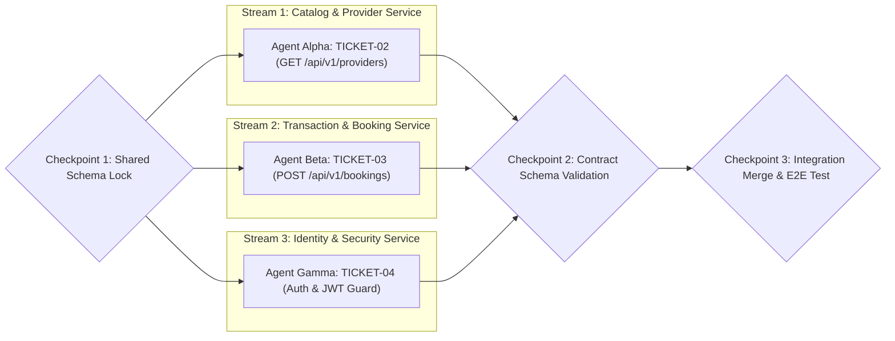

# Parallel Execution & Coordination Plan (Module 06)

---

## 1. Executive Summary & Parallel Strategy
- **Parallelism Strategy**: **Isolated Git Branches** (`isolated_branches`). Each parallel worker/agent operates on an isolated worktree branch with shared read-only access to `module-06-interface-contracts.md`.
- **Synchronization Design**: **Checkpoint Syncs** (`checkpoint_syncs`). Checkpoints are executed at Phase 1 (Schema lock), Phase 2 (Mid-flight contract validation), and Phase 3 (End-to-end integration test).

---

## 2. Workstream Allocation & Assignment Matrix



| Stream ID | Worker / Agent | Assigned Ticket | Branch Name | Deliverable |
| :--- | :--- | :--- | :--- | :--- |
| **Stream 1** | Agent Alpha (Backend Dev 1) | **TICKET-02** | `feat/providers-catalog` | Provider listing controller, DTOs, and unit tests |
| **Stream 2** | Agent Beta (Backend Dev 2) | **TICKET-03** | `feat/booking-creation` | Booking transaction endpoint, validation, idempotency |
| **Stream 3** | Agent Gamma (Security Dev) | **TICKET-04** | `feat/auth-jwt-guard` | User registration, argon2 hashing, JWT guard |

---

## 3. Checkpoint Milestones & Verification Gates

### Checkpoint 1: Shared Schema & Contract Lock (T+0 mins)
- **Gate Requirement**: Both `providers` and `bookings` tables agree on UUID primary keys and foreign keys.
- **Verification Command**:
  ```bash
  npm run db:migrate:status && npm run test:types
  ```

### Checkpoint 2: Mid-Flight Contract Conformance (T+20 mins)
- **Gate Requirement**: Inspect each branch's DTO classes and route decorators against `module-06-interface-contracts.md`:
  - Verify route prefix is `/api/v1/providers` (not `/providers`).
  - Verify timestamp validation enforces ISO 8601 string parsing.
  - Catch and rectify any contract violations before code completion.

### Checkpoint 3: Integration Merge & End-to-End Test (T+45 mins)
- **Gate Requirement**: Rebase all 3 branches onto `main`, resolve any non-breaking conflicts, and run integration test suite simulating full customer booking flow.
- **Success Gate**: 100% test suite pass across all 3 modules.
