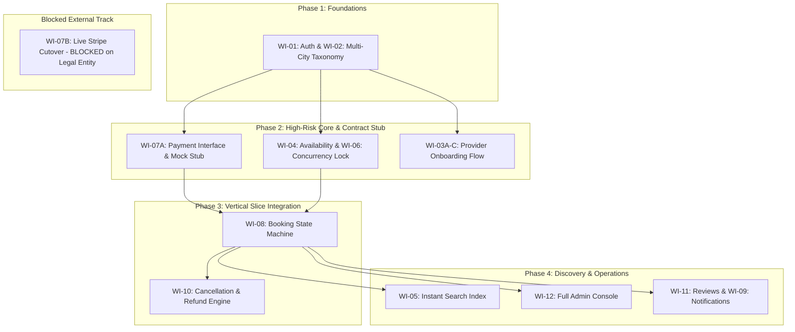

# Module 03: Risk-First Ordering & Vertical Slicing Plan (Adapted with Business Blocker Isolation)

## 1. Node Risk Annotations (4-Quadrant Framework)

| Work Item ID | Name | Risk Score (1-5) | Primary Risk Type | Secondary Risk Type | Risk Profile & Failure Mode Rationale |
| :--- | :--- | :--- | :--- | :--- | :--- |
| **WI-01** | User Auth & RBAC | **2** | Dependency | — | Low technical novelty; high dependency blast radius as root foreign key. |
| **WI-02** | Core Data Models & City Taxonomy | **3** | Scale | Dependency | Multi-city expansion schema must support 5 cities without future migrations. |
| **WI-03A** | Provider Draft Profile Submission | **1** | — | — | Standard CRUD forms and document uploads; low uncertainty. |
| **WI-03B** | Admin Review Tool (Minimal) | **2** | Novelty | — | State transition logic (`PENDING` -> `APPROVED`); straightforward implementation. |
| **WI-03C** | Verified Provider Profile & Public View | **1** | — | — | Read-only public profile queries; standard pattern. |
| **WI-04** | Availability & Slot Schedule Engine | **3** | Novelty | — | Timezone normalization and recurring weekly schedule generation logic. |
| **WI-05** | Instant Search & Category Index | **3** | Scale | — | Sub-200ms p95 latency SLA under multi-city dataset growth. |
| **WI-06** | Slot Reservation & Concurrency Lock | **5** | Novelty | Scale | Race-condition mitigation; two concurrent learners booking the exact same millisecond. |
| **WI-07A** | Payment Interface Contract & Stub | **1** | Contract | — | In-memory mock adapter unblocking booking state machine immediately. |
| **WI-07B** | Live Stripe Gateway Integration | **5** | External Blocker | Integration | **[BLOCKED]** Waiting on client legal entity and Stripe merchant account setup. |
| **WI-08** | Booking State Machine | **4** | Novelty | Dependency | Central marketplace transaction engine; operates against `IPaymentGatewayAdapter`. |
| **WI-09** | Notification & Email Dispatcher | **1** | Integration | — | Standard async background queue (Resend/SendGrid); non-blocking soft dependency. |
| **WI-10** | Cancellation & Refund Orchestration | **4** | Integration | Novelty | Financial reversal logic executed against payment interface contract. |
| **WI-11** | Reviews, Ratings & No-Show Flagging | **2** | — | — | Post-session rating compute and fraud reporting; well-understood pattern. |
| **WI-12** | Admin Console, Disputes & Payouts | **3** | Integration | — | Rolling 7-day automated provider escrow batch transfers and dispute audit tooling. |

---

## 2. Business Blocker Isolation & Interface Contract Pattern

### PM Escalation Communication:
> "Live payment processing is currently blocked because the client has not finalized their business entity or Stripe merchant account. We have established an `IPaymentGatewayAdapter` contract with an in-memory test harness so booking, slot concurrency, and cancellation workflows continue at full velocity without delay. Could you please provide an estimated resolution date for the merchant paperwork so we can schedule the live adapter cutover?"

### Interface Contract Specification (`IPaymentGatewayAdapter`):
```typescript
export interface PaymentIntentRequest {
  bookingId: string;
  learnerId: string;
  providerId: string;
  amountCents: number;
  currency: string;
  platformFeeCents: number;
}

export interface PaymentIntentResult {
  status: 'AUTHORIZED' | 'CAPTURED' | 'FAILED';
  transactionId: string;
  capturedAt: string;
  errorCode?: string;
}

export interface IPaymentGatewayAdapter {
  authorizeAndHold(request: PaymentIntentRequest): Promise<PaymentIntentResult>;
  captureEscrow(transactionId: string): Promise<PaymentIntentResult>;
  refund(transactionId: string, amountCents: number, reason: string): Promise<PaymentIntentResult>;
}
```

---

## 3. Revised Phased Build Order (Zero-Blocked Parallel Team Velocity)



1. **Step 1: WI-01 (Auth) + WI-02 (Multi-City Data Model)** — Foundation for entities and city tenancy.
2. **Step 2: WI-07A (Payment Interface Contract & Mock Adapter)** — De-risks financial data flow in Day 1 without external API blockers.
3. **Step 3: WI-03A-C (Provider Onboarding & Minimal Approval)** — Unblocks verified provider availability.
4. **Step 4: WI-04 (Availability Engine) + WI-06 (Slot Concurrency Lock)** — Retires the highest remaining technical novelty risk (race condition locks).
5. **Step 5: WI-08 (Booking State Machine) + WI-10 (Cancellation Engine)** — Delivers full vertical booking slice against stubbed payments.
6. **Step 6: WI-05 (Instant Search & Category Index)** — Optimizes multi-city query latency (<200ms).
7. **Step 7: WI-12 (Admin Ops Suite) + WI-11 (Reviews) + WI-09 (Notifications)** — Terminal operational workflows.
8. **Step 8: WI-07B (Live Stripe Integration Cutover)** — Drop-in replacement for mock adapter once merchant credentials arrive.
