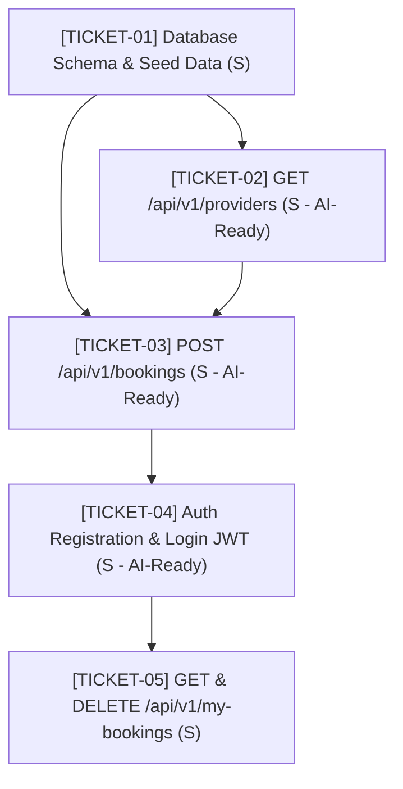

# Ticket Index: SkillSwap Phase 1 (Module 05)

## Overview & Execution Dependency Graph
This ticket suite decomposes Slice 1 (Anonymous Browse & Instant Booking) and Slice 2 (User Identity & Authenticated Management) into 5 self-contained, executable engineering specifications.

---

## Ticket Roster

| Ticket ID | Title | Slice | Target Complexity | AI-Ready Bar | File |
| :--- | :--- | :--- | :--- | :--- | :--- |
| **TICKET-01** | Database Schema Migration & Provider Seeding | Slice 1 | S (1 hr) | Standard | [`ticket-01-seed-providers.md`](file:///D:/Caw%20Studios/upsk-system-design-workspace/artifacts/tickets/module-05/ticket-01-seed-providers.md) |
| **TICKET-02** | `GET /api/v1/providers` — List Seeded Providers | Slice 1 | S (1.5 hrs) | **AI-Ready** | [`ticket-02-get-providers.md`](file:///D:/Caw%20Studios/upsk-system-design-workspace/artifacts/tickets/module-05/ticket-02-get-providers.md) |
| **TICKET-03** | `POST /api/v1/bookings` — Create Anonymous Booking | Slice 1 | S (2 hrs) | **AI-Ready** | [`ticket-03-post-bookings.md`](file:///D:/Caw%20Studios/upsk-system-design-workspace/artifacts/tickets/module-05/ticket-03-post-bookings.md) |
| **TICKET-04** | `POST /api/v1/auth/register` & `login` — JWT Authentication | Slice 2 | S (2 hrs) | **AI-Ready** | [`ticket-04-auth-register-login.md`](file:///D:/Caw%20Studios/upsk-system-design-workspace/artifacts/tickets/module-05/ticket-04-auth-register-login.md) |
| **TICKET-05** | `GET /api/v1/my-bookings` & `DELETE /:id` — Customer Dashboard | Slice 2 | S (2 hrs) | Standard | [`ticket-05-get-my-bookings.md`](file:///D:/Caw%20Studios/upsk-system-design-workspace/artifacts/tickets/module-05/ticket-05-get-my-bookings.md) |
