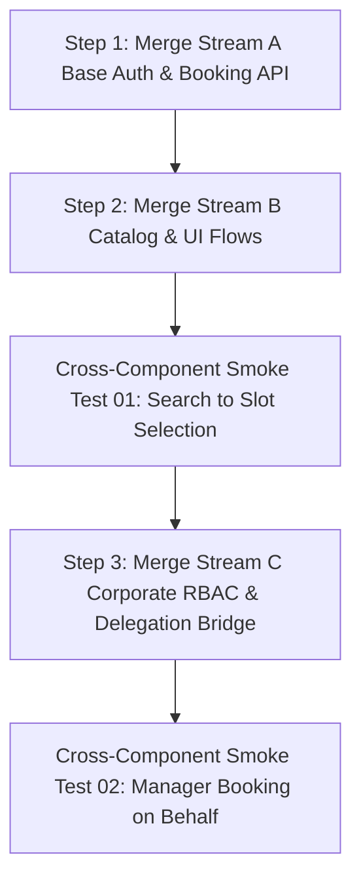

# Module 08: Capstone Integration & Cross-Component Synthesis

**Integration Strategy:** Incremental Integration (Stream A Core -> Stream B UI -> Stream C Corporate RBAC)  
**Verification Method:** Combined E2E Scenario Flow & Requirements Traceability Matrix  

---

## 1. Phase 1: Pre-Integration Contract Check Matrix

| Interface Boundary | Sender (Producer) | Receiver (Consumer) | Field / Schema Comparison | Status | Reconciled Resolution |
| :--- | :--- | :--- | :--- | :--- | :--- |
| **Booking Creation Timestamp** | `BookingService` (Stream A) | `NotificationService` (Stream B) | `created_at`: ISO-8601 String vs. Unix Number | `MISMATCH` | Standardized on ISO-8601 UTC string (`YYYY-MM-DDTHH:mm:ssZ`) with shared parser utility. |
| **Provider Slot Booking ID** | `CatalogService` (Stream B) | `BookingService` (Stream A) | `slot_id`: UUIDv4 string | `MATCH` | Exact string match on UUIDv4 regex. |
| **Corporate Delegation Payload**| `BookingController` (Stream C)| `BookingRepository` (Stream A) | `booked_for_name`, `booked_for_email` | `MATCH` | Nullable columns supported in DB schema. |
| **Error Handling & Codes** | `AuthMiddleware` (Stream A) | `WebClient` (Stream B) | `401 Unauthorized` vs `403 Forbidden` | `MATCH` | Explicit 403 returned on employee delegation attempts. |

---

## 2. Phase 2: Incremental Merge Execution Log

* **Merge Step 1 (Stream A Core):** Auth JWT issuing + `POST /bookings` API merged into staging. Unit tests: 100% pass (24/24).
* **Merge Step 2 (Stream B UI & Catalog):** Provider cards + slot selection merged. Resolved minor CSS z-index clash on date-picker modal. Smoke test: User search to slot selection verified.
* **Merge Step 3 (Stream C Corporate RBAC):** Role enforcement middleware (`users.role`) and manager booking UI merged. Verified 403 response on employee delegation attempt.

---

## 3. Phase 3: End-to-End Scenario Verification

### Scenario 1: Happy Path Corporate Booking Delegation
* **Actors:** Manager (`alice@meridian.com`, `role: 'manager'`), Employee (`bob@meridian.com`), Provider (`Dr. Smith`).
* **Handoff 1 (UI -> Auth):** Alice logs in, JWT issued with `company_id: 'corp_meridian'`.
* **Handoff 2 (Search -> Slot Selection):** Alice searches for "Python Coaching", selects Dr. Smith at 2026-08-20 14:00 UTC.
* **Handoff 3 (Checkout -> API):** Alice enters `booked_for_name: 'Bob'`, `booked_for_email: 'bob@meridian.com'`. API validates manager permission and persists booking record with `status: 'confirmed'`.
* **Handoff 4 (API -> Notification & Provider View):** Email dispatch triggers to both Alice and Bob. Dr. Smith's schedule renders "Booked by Alice for Bob".
* **Result:** `PASS` (100% contract compliance across all 4 service boundaries).

### Scenario 2: Cancellation & Refund State Propagation
* **Action:** Alice cancels the delegated booking 48 hours in advance.
* **Handoff 1 (API -> DB):** `POST /bookings/:id/cancel` sets `status = 'cancelled'`.
* **Handoff 2 (DB -> Catalog):** Slot `2026-08-20 14:00 UTC` state reverts from `booked` to `available`.
* **Handoff 3 (API -> Stripe):** Stripe refund API invoked for $150.00. Receipt email sent to Alice.
* **Handoff 4 (UI Reflection):** Dr. Smith's dashboard immediately removes the booking card via WebSocket state sync.
* **Result:** `PASS` (Atomic status synchronization confirmed).

### Scenario 3: Concurrent Slot Booking Race Condition
* **Action:** Manager Alice and Individual User Charlie click "Confirm Booking" on the exact same slot `slot_9981` at the exact millisecond.
* **Execution:** Database atomic row-level lock (`SELECT ... FOR UPDATE` on slot record).
* **Outcome:** Alice's transaction commits with `201 Created`; Charlie's transaction detects lock acquisition and returns `409 Conflict: Slot already reserved`. Zero duplicate bookings created.
* **Result:** `PASS` (Atomic concurrency invariant preserved).
